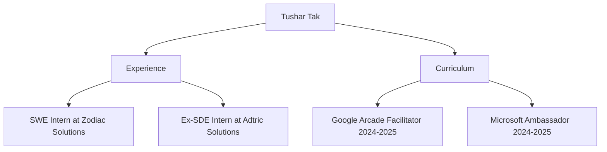

<!-- Modern gradient typing header -->

<!-- Minimalist badge links with hover effects -->

  
  
  

<!-- Modern view counter -->

  

## 🚀 About Me

👋 Hi, I'm Tushar Tak, a passionate Software Engineer and Full Stack Developer.

🌐 I love building modern web applications, scalable APIs, and cloud-native solutions.

💼 Explore my portfolio and resume at [tushartak.works](https://tushartak.works) for more about my projects, experience, and skills.

🛠️ Proficient in JavaScript, TypeScript, React, Next.js, Node.js, Express, MongoDB, SQL, AWS, Docker, and more.

🚀 Always learning and exploring new technologies in the world of software engineering.

## 🔥 GitHub Highlights

  <!-- Trophies with better spacing -->
  

    
  

  <!-- Streak stats with consistent styling -->
  

  

## 🛠️ Tech Stack

  
  
  
  
  
  
  
  
  
  
  
  

## 🌐 Connect With Me

  
  
  
  

