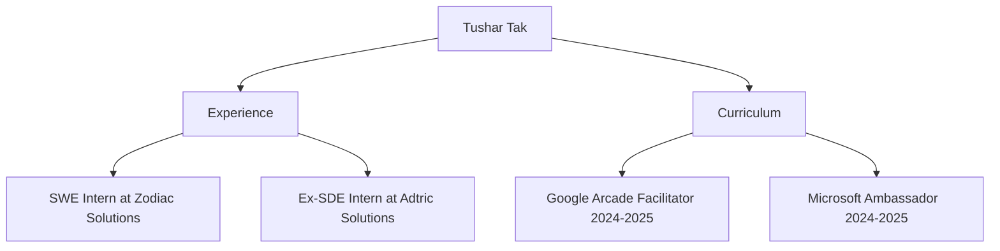

<!-- Modern gradient typing header -->

<!-- Minimalist badge links with hover effects -->

  
  
  
  

<!-- LinkedIn animated typing banner -->

  

<!-- Modern view counter -->

  

## 🚀 About Me

👋 Hi, I'm Tushar Tak, a passionate Software Engineer and Full Stack Developer.

🌐 I love building modern web applications, scalable APIs, and cloud-native solutions.

💼 Explore my portfolio and resume at [tushartak.works](https://tushartak.works) for more about my projects, experience, and skills.

🛠️ Proficient in JavaScript, TypeScript, React, Next.js, Node.js, Express, MongoDB, SQL, AWS, Docker, and more.

🚀 Always learning and exploring new technologies in the world of software engineering.

<!-- LinkedIn Connect Animated Box -->

  

    

      <svg width="100%" height="100%" style="position:absolute;top:0;left:0;z-index:0;">
        <rect x="0" y="0" width="100%" height="100%" rx="18" fill="none" stroke="url(#animated-border)" stroke-width="4">
          <animate attributeName="stroke-dasharray" values="10,10;20,10;10,20;10,10" dur="2s" repeatCount="indefinite" />
        </rect>
        <defs>
          <linearGradient id="animated-border" x1="0" y1="0" x2="1" y2="1">
            <stop offset="0%" stop-color="#0A66C2" />
            <stop offset="100%" stop-color="#38BDF8" />
          </linearGradient>
        </defs>
      </svg>
    

    

      
      
    

  

## 🔥 GitHub Highlights

  <!-- Trophies with better spacing -->
  

    
  

  <!-- Streak stats with consistent styling -->
  

  

## 🌐 Connect With Me

  
  
  
  
  

